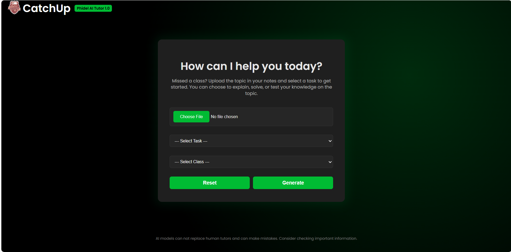
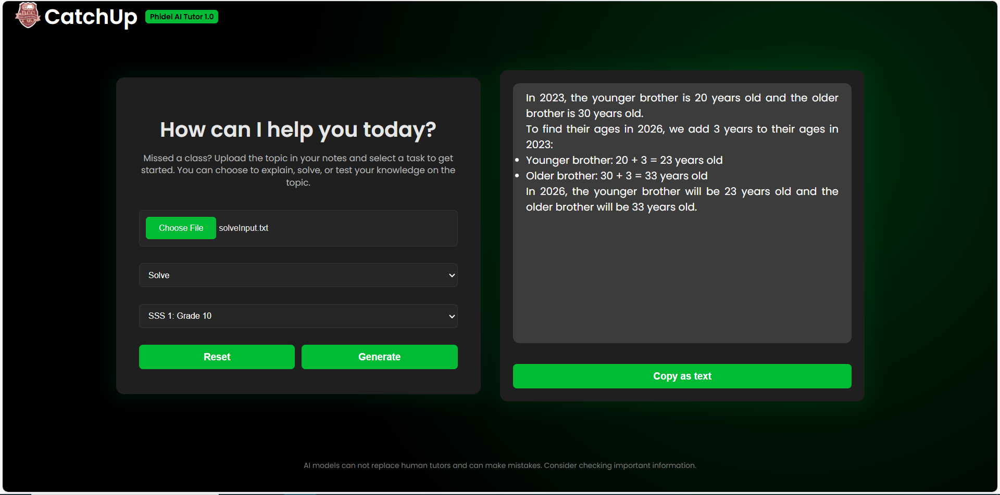

# CatchUp - Phidel AI Tutor <small>1.0.0</small>

A Flask-based web application that allows students to upload documents containing topics they missed and interact with them. The Phidel AI tutor can explain, solve or test the student on the topics covered in the documents based on their class level.

[](https://github.com/willgee9531/CatchUp_Phidel_AI_Tutor)
[](LICENSE)
[](https://www.python.org/)
[](https://flask.palletsprojects.com/)


_Home Page_


_Generated Response_

## Table of Contents

- [Features](#features)
- [Technologies Used](#technologies-used)
- [Installation Instructions](#installation-instructions)
- [Usage Instructions](#usage-instructions)
- [Contributing](#contributing)
- [Code of Conduct](#code-of-conduct)
- [Known Issues](#known-issues)
- [Future Enhancements](#future-enhancements)
- [License](#license)
- [Contact](#contact)
- [Acknowledgments](#acknowledgments)

## Features

- Document Upload: Students can upload documents in various formats (PDF, DOCX, TXT, JSON).
- Chat Interface: Students can interact with the uploaded documents through a form-based chat interface.
- AI Tutor: The Phidel AI tutor can explain concepts, solve problems, and test students on the topics covered in the documents.
- Class Level Support: The system supports different class levels, allowing students to upload documents relevant to their studies.
- Document Search: Students can search for specific topics within the uploaded documents.
- Document Processing: Processes documents to extract text and generate embeddings.
- Document Embeddings: Uses embeddings to represent document content for efficient retrieval and interaction.
- Responsive Design: The application is designed to be responsive and user-friendly across devices.
- Error Handling: Includes error handling for file uploads and interactions.

## Technologies Used:

- Flask: Web framework for building the application.
- Vector Database: For storing and retrieving document embeddings.
- HTML/CSS/JavaScript: For the front-end interface.
- Jinja2: Templating engine for rendering HTML pages.

## Installation Instructions:

1. Clone the repository:

   ```bash
   git clone https://github.com/willgee9531/CatchUp_Phidel_AI_Tutor
   ```

2. Navigate to the project directory:
   ```bash
   cd CatchUp_Phidel_AI_Tutor
   ```
3. Create a virtual environment:
   ```bash
   python -m venv venv
   ```
4. Activate the virtual environment:

   _On Windows:_

   ```bash
   venv\Scripts\activate
   ```

   _On macOS/Linux:_

   ```bash
   source venv/bin/activate
   ```

5. Install the required packages:
   ```bash
   pip install -r requirements.txt
   ```
6. Run the application:
   ```bash
   python run.py
   ```

## Usage Instructions:

1. Open your web browser and navigate to `http://localhost:5000`.
2. Use the form-based chat interface to upload documents and interact with them.
3. You can ask the Phidel AI tutor to explain, solve, or test you on the topics covered in the uploaded documents.

## Contributing:

Contributions are welcome! Please follow these steps:

1. Fork the repository.
2. Create a new branch for your feature or bug fix:

   ```bash
   git checkout -b feature/your-feature-name
   ```

3. Make your changes and commit them:
   ```bash
   git commit -m "Add your commit message"
   ```
4. Push your changes to your fork:
   ```bash
   git push origin feature/your-feature-name
   ```
5. Create a pull request to the main repository.
6. Ensure your code adheres to the project's coding standards and includes appropriate tests.
7. Review the project's [Code of Conduct](CODE_OF_CONDUCT.md) before contributing.
8. If you are adding new features, please update the documentation accordingly.
9. If you find any issues, please report them in the [Issues](https://github.com/willgee9531/CatchUp_Phidel_AI_Tutor/issues) section of the repository.
10. If you have any questions or need help, feel free to reach out to the project maintainers.

## Code of Conduct:

This project adheres to the [Contributor Covenant Code of Conduct](CODE_OF_CONDUCT.md).
By participating, you are expected to uphold this code. Please report any unacceptable behavior to the project maintainers.

## Known Issues:

- The document processing may take some time for large files.
- Some document formats may not be fully supported.
- The AI tutor's responses may vary in accuracy depending on the complexity of the topics covered in the documents.

## Future Enhancements:

- Support for additional document formats (e.g., EPUB, HTML).
- Improved AI tutor capabilities for more complex problem-solving.
- User authentication and profile management.
- Integration with external educational resources and APIs.
- Enhanced search functionality for better topic retrieval.
- Support for collaborative document editing and sharing.
- Implementation of a feedback system for students to rate the AI tutor's responses.
- Addition of a dashboard for students to track their progress and interactions.

## License:

This project is licensed under the MIT License. See the [LICENSE](LICENSE) file for details.

## Contact:

For any questions or issues, please contact the project maintainer at [willgee9531@gmail.com](mailto:willgee9531@gmail.com)

## Acknowledgments:

- Thanks to the open-source community for their contributions and support.
- Special thanks to the developers of Flask and the vector database used in this project.
- Thanks to [xtekky gpt4free](https://github.com/xtekky/gpt4free)'s solid impact on the project.
